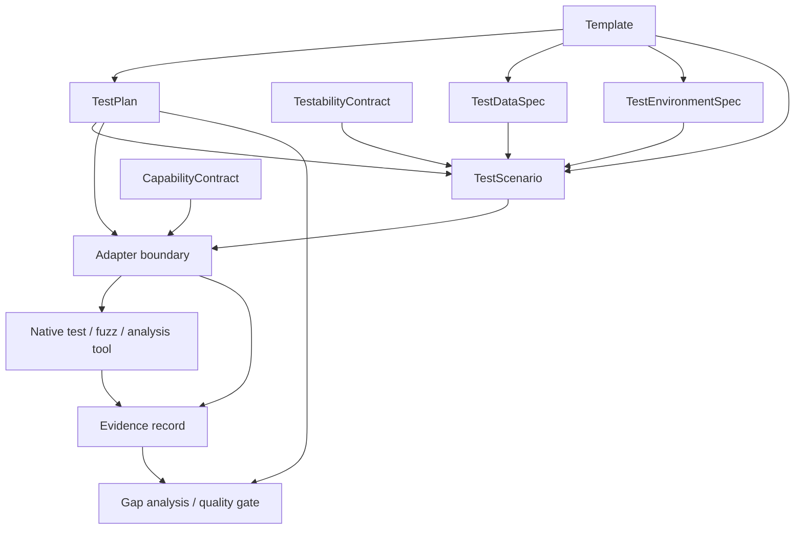

# RFC 0001: Core Testule model

- **Status:** Accepted
- **Target maturity:** incubating
- **Scope:** language-neutral model, execution boundary, evidence model, and first implementation sequence

## Summary

Testule should provide a portable testing capability layer built around declarative test requirements, explicit testability contracts, reusable data and environment specifications, executable scenarios, bounded capability contracts, adapters to native test tools, and normalized evidence.

The project should not replace ecosystem-native test runners. Its role is to make testing requirements and evidence portable, composable, reproducible, and safe to expose to automation and AI agents.

The model intentionally distinguishes three kinds of concepts:

1. **authoring resources** that users declare and version;
2. **execution and governance contracts** that define how work may be performed;
3. **evidence records** that describe what actually happened.

This separation prevents implementation mechanisms such as adapters from accidentally becoming user-facing schema commitments.

## Problem

Testing intent is commonly distributed across code, CI workflows, fixtures, environment scripts, fuzz harnesses, test framework configuration, and undocumented team conventions. As a result:

- test coverage is difficult to reason about across levels and behavioral classes;
- positive, negative, boundary, adversarial, and security cases are inconsistently represented;
- fuzzing and property testing are often separate experiments instead of reusable capabilities;
- generated data is frequently non-reproducible or detached from its provenance;
- test environments are implicit and differ between local and CI execution;
- failure artifacts are not consistently minimized or promoted into regression tests;
- agentic testing often receives excessive ambient authority and weak execution contracts;
- evidence is framework-specific and hard to aggregate into a trustworthy answer about capability completeness.

## Goals

1. Express test requirements independently from a particular language or runner.
2. Model the full applicable test pyramid without requiring irrelevant layers.
3. Represent black/gray/white-box visibility and positive/negative/boundary/adversarial behavior explicitly.
4. Make generated data, templates, environmental configuration, property testing, and fuzzing first-class.
5. Make failures reproducible through retained inputs, environment identity, tool versions, and artifacts; retain deterministic seeds where the underlying generator exposes them.
6. Allow native testing tools to participate through adapters rather than replacement.
7. Provide bounded testing capabilities suitable for automation and AI agents.
8. Normalize evidence sufficiently to support gap analysis, quality gates, replay, and completion review.
9. Keep the initial implementation small enough to validate the model through one real ecosystem before generalizing.

## Non-goals

The first versions will not:

- provide a universal replacement test runner;
- implement every environment provider, test framework, fuzz engine, or data generator;
- own CI/CD scheduling, deployment, or release management;
- use AI judgement as the default correctness oracle;
- infer production secrets or ingest sensitive production data by default;
- guarantee hermetic execution when an adapter explicitly targets a real external dependency;
- require every test type for every repository;
- define a stable cross-language adapter protocol before the first native integration proves what is required.

## Conceptual model



The diagram is conceptual. It does not imply that every node is serialized as the same kind of `apiVersion`/`kind` resource.

## Domain concept classes

### Authoring resources

These are declarative inputs owned by the Testule specification and are candidates for versioned `apiVersion`/`kind` serialization:

- **TestPlan**
- **TestabilityContract**
- **TestDataSpec**
- **TestEnvironmentSpec**
- **Template**
- **TestScenario**

### Execution and governance contracts

These define how declared intent becomes bounded execution:

- **CapabilityContract** — the authority, inputs, outputs, limits, and evidence requirements for an operation;
- **Adapter** — an implementation boundary that maps Testule semantics to a native toolchain and maps native results back to Testule evidence.

`CapabilityContract` may eventually have a serialized representation, but that does not require it to share the same lifecycle as authoring resources. `Adapter` is not a user-authored core resource and must not require a `kind: Adapter` representation in `v1alpha1`.

### Evidence records

**Evidence** is generated output describing what happened. It requires a versioned envelope and conformance rules, but it is not authoring configuration and should not be treated as though users declare test results.

This leaves nine named core concepts while keeping their lifecycle and compatibility responsibilities distinct.

## Authoring resources

### TestPlan

Declares **what must be verified** and which quality gates apply.

Representative concerns:

- subject/component/system under test;
- required test levels;
- behavioral classes;
- visibility model;
- generation strategies;
- quality attributes;
- execution profiles;
- coverage or mutation expectations where meaningful;
- required evidence and quality gates;
- justified omissions.

A plan must not imply that every available dimension is mandatory. It should make applicable dimensions explicit and record intentional exclusions when they materially affect completeness claims.

### TestabilityContract

Declares **how a subject can be controlled and observed for trustworthy testing**.

Representative capabilities:

- injectable dependencies;
- controllable clock;
- seedable randomness;
- state reset;
- filesystem virtualization;
- network virtualization;
- dependency/service substitution;
- fault injection;
- deterministic scheduling or concurrency controls;
- test identities and authorization contexts;
- observability hooks;
- invariants and externally observable properties.

This resource is about design-for-testability, not a particular test framework.

### TestDataSpec

Declares fixtures and generated data together with provenance and reproducibility constraints.

Generation strategies should be extensible but initially include:

- canonical/example;
- seeded random;
- boundary;
- negative/invalid;
- combinatorial or pairwise;
- property-based;
- fuzz corpus;
- adversarial;
- synthetic scale;
- state-machine or event sequence.

A generated failure must retain enough information to reconstruct the exact input when the generator supports deterministic replay.

Production-derived data is outside the default trust model and requires explicit authorization, provenance, and privacy handling.

### TestEnvironmentSpec

Declares environmental state that materially affects execution.

Representative dimensions:

- OS and architecture;
- runtime/compiler/tool versions;
- services and dependencies;
- environment variables;
- ephemeral secret references;
- network policy;
- filesystem layout and lifecycle;
- locale and timezone;
- clock mode;
- random seed when applicable;
- feature flags;
- database or durable state;
- identity and authorization context;
- CPU, memory, disk, and concurrency limits;
- external service virtualization;
- cleanup and reset semantics.

Environment matrices should distinguish required compatibility combinations from sampled or risk-based combinations to avoid uncontrolled Cartesian expansion.

### Template

Templates provide reusable semantic defaults for plans, data, environments, or scenarios.

Templates should be parameterized and composable. Composition must eventually have explicit precedence, cycle detection, conflict behavior, and trust rules; opaque inheritance chains are undesirable.

Example categories:

- `service/http-api`;
- `security/untrusted-input`;
- `storage/postgres-integration`;
- `fuzz/parser`;
- `environment/hermetic-linux`.

Template composition is deliberately not part of the first CLI slice.

### TestScenario

Composes resources needed to describe an executable behavioral outcome.

A scenario may contain:

- subject and entrypoint;
- environment;
- data or generation strategy;
- initial state;
- actions/events;
- injected faults;
- expected assertions or invariants;
- execution budget;
- evidence requirements.

A single scenario may be executed through multiple adapters or generation strategies when the semantics remain meaningful.

## Execution and governance contracts

### CapabilityContract

Declares a bounded testing operation suitable for a CLI, automation, or agent.

Candidate capability families:

- `testing.validate-plan`;
- `testing.inspect-gaps`;
- `testing.generate-tests`;
- `testing.generate-properties`;
- `testing.generate-data`;
- `testing.generate-fuzz-harness`;
- `testing.execute-plan`;
- `testing.execute-fuzz`;
- `testing.triage-failure`;
- `testing.minimize-reproducer`;
- `testing.propose-regression`;
- `testing.review-testability`.

Each capability invocation should be able to constrain:

- readable and writable paths;
- process execution;
- network access;
- secret access;
- environment mutation;
- execution time/resources;
- accepted adapters/tools;
- deterministic replay requirements where supported;
- permitted output mutations;
- required evidence.

AI-specific behavior is layered on these capabilities; the core contract should remain useful for non-AI automation.

### Adapter

An adapter translates Testule intent into ecosystem-native execution and translates results into normalized evidence.

Adapters should prefer explicit subprocess boundaries and stable native interfaces over in-process plugin mechanisms that create ABI or trust coupling.

The first implementation target is Go because one ecosystem can exercise unit tests, integration tests, static analysis, and native fuzzing without requiring Testule to invent those mechanisms.

The permanent cross-language adapter protocol is intentionally deferred until the Go slice establishes concrete requirements.

## Evidence

Evidence is a generated, versioned record of **what actually happened**.

Minimum candidate fields include:

- plan/scenario identity and version;
- subject revision;
- adapter and native tool versions;
- environment identity/fingerprint;
- generator and seed/corpus/input identity where applicable;
- start/end time and execution budget;
- result/status;
- assertions or invariant failures;
- coverage/mutation/security signals when available;
- logs/traces/artifact references;
- minimized or replayable reproducer reference;
- skipped or unsupported requirements;
- provenance and integrity metadata.

A passing native command is insufficient when required evidence is missing or a required TestPlan dimension was not exercised.

Raw native output may be retained alongside normalized evidence so normalization does not erase diagnostically important semantics.

## Test dimensions

The model treats these as orthogonal dimensions rather than separate competing taxonomies.

### Level

- unit/component;
- contract;
- integration;
- system;
- end-to-end.

### Visibility

- black-box;
- gray-box;
- white-box.

### Behavior

- positive;
- negative;
- boundary;
- adversarial.

### Generation

- example/table-driven;
- generated;
- property-based;
- fuzz;
- model/state-machine;
- AI-assisted.

### Oracle

Preferred order when suitable:

1. deterministic assertion;
2. invariant/property;
3. differential/reference implementation;
4. metamorphic relation;
5. statistical oracle;
6. AI-assisted judgement.

AI judgement is intentionally last because it is harder to reproduce, calibrate, and treat as authoritative.

### Quality attribute

- functional correctness;
- security;
- performance/capacity;
- resilience/recovery;
- compatibility/migration;
- operational behavior.

## Fuzzing model

Fuzzing is not restricted to byte-level unit tests. Testule should be able to represent fuzzing at several boundaries:

- functions and parsers;
- serialization/protocol layers;
- API request bodies and sequences;
- state machines;
- storage inputs and migrations;
- event/order/concurrency schedules where supported;
- environmental and fault conditions.

A fuzz execution should conceptually follow:

```text
generate/mutate -> execute -> detect failure -> preserve -> minimize when supported -> replay -> promote regression -> retain corpus
```

The first implementation only needs to prove this lifecycle for Go native fuzzing. Testule must preserve the concrete failing input or corpus artifact used by the native tool; a stable numeric random seed is required only when the underlying generator/tool exposes one as a replay contract.

## Generated data model

Generated data should be declarative enough to express constraints while allowing generator-specific extensions.

Required properties for the first data-capable version:

- deterministic seed support where the underlying generator permits it;
- explicit invalid/negative generation;
- boundary generation;
- provenance of generated fixtures;
- bounded record/size/resource limits;
- no production PII or secrets by default;
- serialization suitable for replay and CI artifacts.

Schema-driven generation is desirable, but the core model must not assume JSON Schema is the only source type.

## Environment model

An environment is a test input, not hidden runner state.

Environment providers may eventually include:

- local process;
- containers;
- compose-like multi-service environments;
- Kubernetes;
- VM/sandbox providers;
- external integration environments.

The first implementation should avoid building a general environment orchestrator. It should eventually validate and fingerprint environment requirements, then introduce provisioning only where a concrete adapter requires it.

## Gap analysis

A principal user-facing capability is to compare declared requirements with discovered or produced evidence.

Conceptually:

```text
TestPlan + repository inspection + adapter capabilities + Evidence -> coverage/gap matrix
```

A matrix should be able to identify gaps such as:

- missing negative integration coverage;
- parser accepts untrusted bytes but has no fuzz target;
- TestabilityContract declares controllable time but tests use wall clock;
- required static analysis exists locally but is absent from CI;
- an end-to-end path exists but lacks failure-path validation;
- a required environment combination has never produced evidence;
- an adapter cannot satisfy a declared plan requirement.

Testule should report unsupported, skipped, stale, or mismatched requirements explicitly rather than silently treating them as passing.

## Security and trust model

Testule will execute or orchestrate code, generated inputs, external tools, and potentially agent-produced artifacts. These are trust boundaries, not implementation details.

Initial requirements:

- repository content, templates, test data, adapter output, logs, and agent output are untrusted inputs;
- path traversal and unintended workspace writes must be prevented;
- secrets are referenced, not embedded in plans or evidence;
- network and process permissions should be explicit for agent-accessible capabilities;
- evidence must redact secret values and avoid copying sensitive environment data;
- generated tests or harnesses are proposals until validated by compilation, static analysis, and bounded execution;
- adapters must declare the tools/commands they invoke and their required permissions;
- fail-open behavior is unacceptable for required quality gates;
- future remote execution requires a stronger isolation, artifact-integrity, and provenance model.

A dedicated threat model is required before Testule executes untrusted generated code in a privileged or remote environment.

## Specification and compatibility

The proposed authoring API identifier is:

```text
testule.dev/v1alpha1
```

`v1alpha1` explicitly allows incompatible resource-shape changes while the first adapters validate the model. No stable compatibility promise is made by this RFC.

### Accepted first-slice rules

The first CLI implementation is intentionally strict and local:

- input is a single local YAML document;
- `apiVersion` must be exactly `testule.dev/v1alpha1`;
- `kind` must be exactly `TestPlan`;
- `metadata.name` is required, must be non-empty, and is limited to 128 Unicode code points with no control characters;
- `subject.component` is required and non-empty;
- `requirements` is required and must contain at least one supported requirement;
- the initial supported requirement groups are `levels` and `behaviors`;
- supported `levels` keys are `unit`, `component`, `contract`, `integration`, `system`, and `endToEnd`;
- supported `behaviors` keys are `positive`, `negative`, `boundary`, and `adversarial`;
- requirement values in this first subset are `required` or `optional`;
- unknown fields inside the implemented subset are rejected rather than ignored;
- file includes, references, template resolution, extension namespaces, remote retrieval, and network access are not supported by the first slice;
- validation must be deterministic and perform no test execution or workspace mutation.

These rules define only the minimum TestPlan subset needed for #3. They do not imply that every future resource uses identical metadata or strictness rules.

Representative valid input:

```yaml
apiVersion: testule.dev/v1alpha1
kind: TestPlan
metadata:
  name: parser
subject:
  component: parser
requirements:
  levels:
    unit: required
    integration: required
  behaviors:
    positive: required
    negative: required
    boundary: optional
```

A future slice may extend TestPlan with generation strategies such as property testing and fuzzing, quality gates, explicit omissions, evidence requirements, and environment/scenario references once their semantics are implemented.

## First implementation slice

After this RFC is accepted, the first executable slice should deliver:

- Go module and CLI skeleton;
- the strict minimal `v1alpha1` TestPlan subset defined above;
- `testule validate <file>`;
- deterministic human-readable diagnostics;
- deterministic machine-readable diagnostics;
- stable documented exit-code categories;
- unit/component tests for parsing, semantic validation, boundaries, and negative cases;
- a CLI integration test for stdout/stderr, exit codes, and fixtures;
- compile/vet/static-analysis/lint entry points wired into canonical task tooling and CI;
- no adapter execution, template resolution, reference loading, environment provisioning, or network access.

This is deliberately smaller than implementing the full domain model in one PR.

## Deferred decisions

The following are intentionally unresolved and should be decided from evidence produced by vertical slices rather than prematurely generalized:

1. **Schema implementation:** JSON Schema, CUE, Go-native validation/schema generation, or another mechanism.
2. **Template composition:** merge rules, conflict detection, parameter typing, and remote template trust.
3. **Adapter protocol:** subprocess/structured stdio, JSON-RPC, gRPC, or another boundary.
4. **Extension model:** namespaced fields, typed extension resources, or adapter-owned configuration.
5. **Evidence serialization/storage:** canonical JSON, structured directory bundle, OCI artifact, or layered model.
6. **Environment provisioning:** validation/fingerprinting core versus provider interfaces.
7. **Agent mutation policy:** which generated outputs may be written directly versus only proposed as patches/artifacts.
8. **Static repository inspection:** language-specific discovery plugins versus explicit declarations as the initial source of truth.
9. **Requirement omission semantics:** how justified non-applicability is represented without conflating absence, optionality, and explicit exclusion.
10. **CapabilityContract serialization:** whether capability policies become portable authoring resources or remain runtime/policy contracts.

## Acceptance criteria for this RFC

The RFC is ready to accept when:

- the project boundary and non-goals are agreed;
- the nine named core concepts are coherent and their classes/ownership do not materially overlap;
- the first Go vertical slice can be implemented from the accepted first-slice rules without deciding all future adapter/provider details;
- fuzzing, generated data, environments, templates, and agent capabilities have an explicit place in the model;
- evidence and reproducibility are first-class rather than afterthoughts;
- material trust boundaries are documented;
- unresolved decisions are explicitly deferred rather than accidentally encoded into a stable contract.
